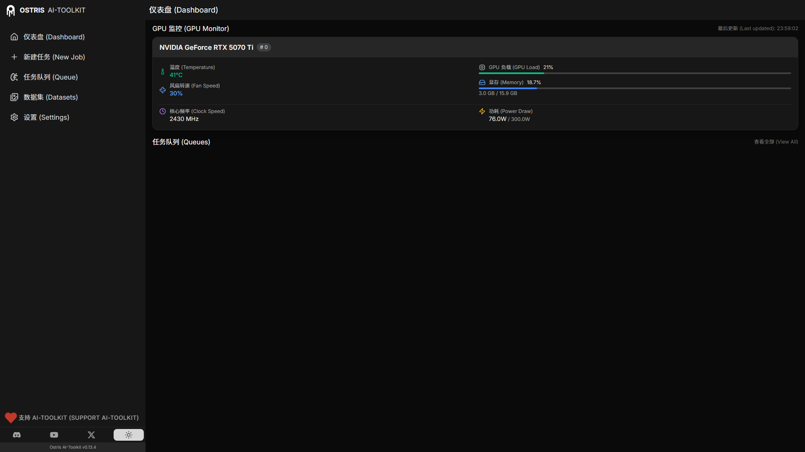
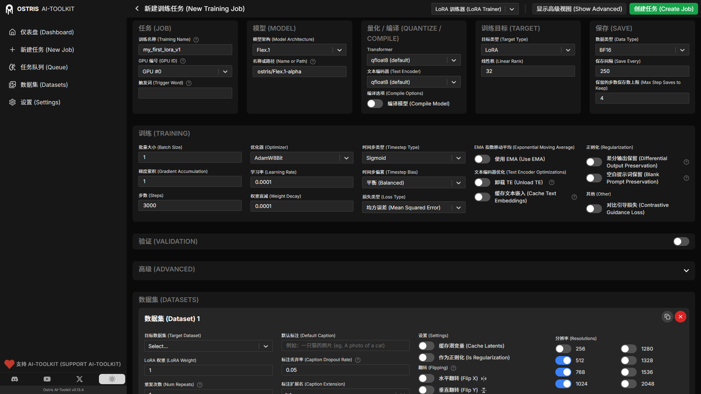

# AI Toolkit 中文汉化版

本仓库是 [ostris/ai-toolkit](https://github.com/ostris/ai-toolkit) 的中文汉化 fork：对 Web UI 做了全量**双语汉化**（`中文 (English)`），训练、推理等所有功能与原版完全一致。

- 官方原版：https://github.com/ostris/ai-toolkit
- 基于版本：**v0.13.4**（commit `9d6a9a0`）
- 上游同步：已合并官方后续提交 `ecb2bfb`（CPU offloading 修复，不影响汉化）
- 汉化提交：`a634a8e`（51 个文件，全部位于 `ui/src/`）
- GitHub Release：**[v0.13.4-l10n](https://github.com/BUR9ERR/ai-toolkit-l10n/releases/tag/v0.13.4-l10n)**（含汉化补丁附件下载）

## 界面预览（汉化效果）






## 怎么用？先花 10 秒选一条路

| 你的情况 | 用哪种方式 |
| --- | --- |
| 还没装过，想直接用汉化版 | **方式一：直接 clone 本仓库**（最简单，推荐） |
| 已经装了官方 ai-toolkit，不想重新下载 | 方式二：打补丁 |
| 不太会用 git，想要现成文件 | 方式三：覆盖文件 |

> **补丁是什么？** 就是一个记录"哪些文件的哪一行改成了什么"的小文件，用 git 自动帮你改，不用手动复制。它只适合"已有官方版、且版本相同"的人；**其他人直接用方式一即可，完全不需要补丁。**

---

### 方式一：直接使用本仓库（推荐，最简单）

clone 下来的就是「官方完整代码 + 汉化」，装好环境直接能用。

```bash
git clone https://github.com/BUR9ERR/ai-toolkit-l10n.git
cd ai-toolkit-l10n
python -m manager install     # 首次安装环境（之前装过可跳过）
python -m manager launch      # 启动 Web UI，浏览器打开 http://localhost:8675
```

---

### 方式二：已有官方版 → 打补丁

适合已经 clone 过官方 ai-toolkit、**版本是 v0.13.4** 的人。

**第 1 步**：下载补丁文件 **[ai-toolkit-l10n-v0.13.4.patch](docs/ai-toolkit-l10n-v0.13.4.patch)**（已随本仓库提供；也可从 [Release v0.13.4-l10n](https://github.com/BUR9ERR/ai-toolkit-l10n/releases/tag/v0.13.4-l10n) 的附件下载），放到官方项目根目录。

**第 2 步**：在官方项目根目录应用：

```bash
git apply ai-toolkit-l10n-v0.13.4.patch
```

**第 3 步**：重新构建并启动（见下方「重新构建」）。

> 补丁只对官方 v0.13.4 有效；若版本不符会报错，此时改用方式一或方式三。

---

### 方式三：覆盖文件（给不会 git 的人）

不需要额外压缩包，直接从 GitHub 下载本仓库的**源码包**（里面自带全部汉化文件）：

1. 打开本仓库页面，点绿色 **Code** 按钮 → **Download ZIP**（或到 [Release v0.13.4-l10n](https://github.com/BUR9ERR/ai-toolkit-l10n/releases/tag/v0.13.4-l10n) 页面下载 **Source code (zip)**）
2. 解压后，把里面的 `ui/` 文件夹**整体**复制
3. 粘贴到你的官方 ai-toolkit 项目根目录，**同名文件直接替换**

不需要打任何命令，之后进入「重新构建」。

> 原理：源码包就是「官方 v0.13.4 + 汉化」的完整代码，其中的 `ui/src/` 已是汉化后的 51 个文件，直接覆盖即完成汉化。

---

## 重新构建（汉化生效的前提）

汉化改的是**前端源码**，必须重新"编译"一次界面才会生效：

```bash
cd ui
npm install      # 首次需要安装依赖
npm run build    # 重新构建前端
cd ..
python -m manager launch    # 启动，浏览器打开 http://localhost:8675
```

---

## 汉化说明

- **双语格式**：`中文 (English)`，中文为主、保留英文原文，方便对照英文文档/源码。
- **术语规范**：严格使用官方术语，专有名词与技术名词保留英文（如 LoRA、FLUX、GPU、VRAM、Checkpoint、Caption、Trigger Word、EMA、Optimizer 等），不强行翻译。
- **汉化范围**：
  - 全部页面：Dashboard / Datasets / Jobs / Settings 等
  - 全部组件：训练配置表单、数据集管理、LoRA 合并、字幕（Caption）、采样图预览、监控面板等
  - 帮助文档（27 条 `?` 弹窗）与提示信息
  - aria-label、placeholder、弹窗消息等无障碍与交互文案
- **不影响**：训练、推理、CLI、后端等任何功能代码，仅改动前端显示文案。

---

## 与上游保持同步

本仓库 fork 自官方，可随时通过 GitHub 的 **Sync fork** 按钮同步上游更新；也可命令行操作（首次需先添加 upstream）：

```bash
git remote add upstream https://github.com/ostris/ai-toolkit.git   # 仅首次
git fetch upstream
git merge upstream/main        # 如与汉化文件冲突需手动解决
```

## 注意事项

- 汉化基于 v0.13.4 源码上下文；上游更新后汉化文件可能产生冲突，同步前建议备份。
- 本 fork 仅做 UI 汉化，功能与官方一致；如遇训练问题请先对照官方仓库排查。
